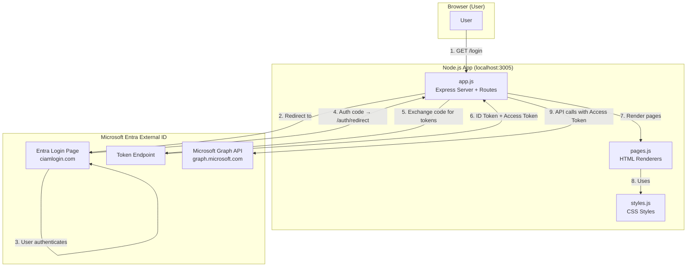
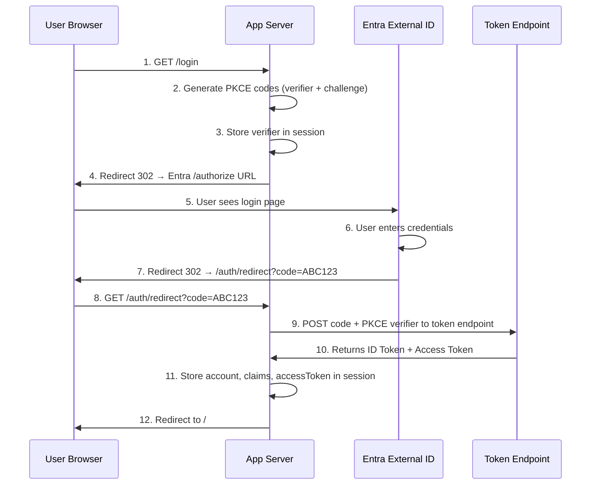
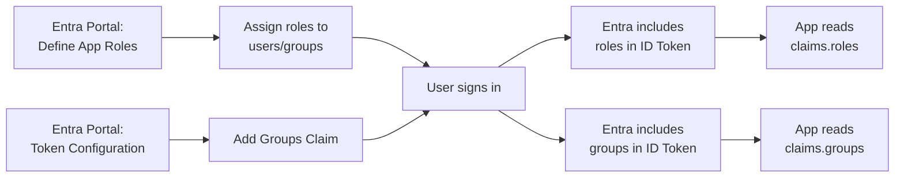
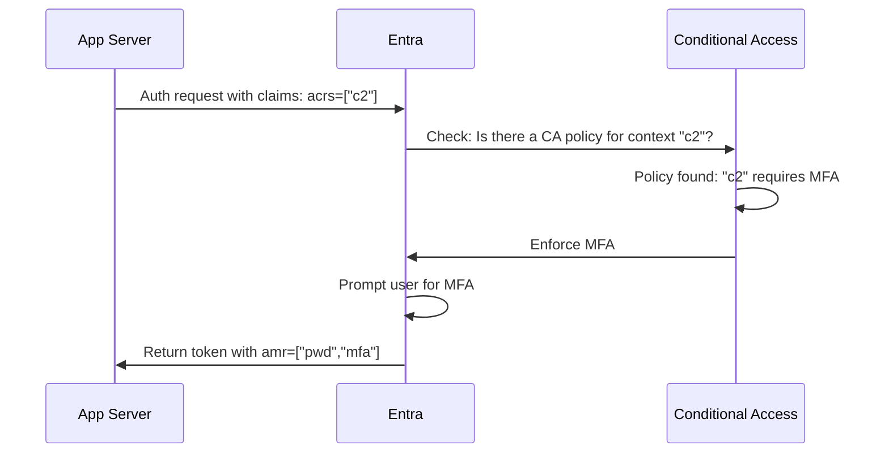
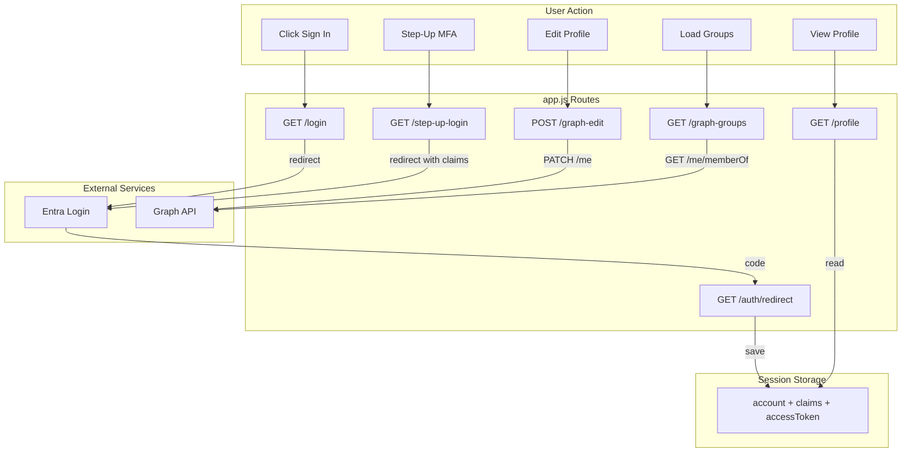

# MS Identity Hub – Complete Code Explanation

A detailed explanation of how every part of the code works, how it connects to **Microsoft Entra External ID**, and how authentication, session management, authorization, step-up auth, and Graph API integration all fit together.

---

## Architecture Overview



| File | Lines | Purpose |
|------|-------|---------|
| [app.js](file:///c:/demo/app.js) | ~290 | Express server, MSAL config, all routes, auth flows, Graph API calls |
| [pages.js](file:///c:/demo/pages.js) | ~540 | HTML page renderers (10 pages + dashboards + error page) |
| [styles.js](file:///c:/demo/styles.js) | ~710 | CSS theme (glassmorphism, sidebar nav, responsive) |

---

## Libraries Used

| Library | Import | What It Does |
|---------|--------|-------------|
| `@azure/msal-node` | `require("@azure/msal-node")` | **Microsoft Authentication Library** – handles OAuth 2.0 / OpenID Connect flows with Entra ID. Generates auth URLs, exchanges codes for tokens, manages PKCE |
| `express` | `require("express")` | Web server framework – handles HTTP routes, request/response |
| `express-session` | `require("express-session")` | Server-side session storage – stores user account, tokens, claims in memory |
| `dotenv` | `require("dotenv").config()` | Loads `.env` file variables into `process.env` |

---

## How the App Connects to Entra External ID

### Configuration (app.js lines 11-27)

```javascript
const CLIENT_ID     = process.env.CLIENT_ID;      // Your app's unique ID in Entra
const CLIENT_SECRET = process.env.CLIENT_SECRET;   // Secret to prove app identity
const TENANT_ID     = process.env.TENANT_ID;       // Your Entra tenant ID
const TENANT_NAME   = process.env.TENANT_NAME;     // Tenant subdomain
const USE_CIAM      = process.env.USE_CIAM === "true";
```

**Authority URL** – This tells MSAL *where* to send users for authentication:

```javascript
// For External ID (CIAM):
const AUTHORITY = `https://${TENANT_NAME}.ciamlogin.com/${TENANT_ID}`;
// Result: https://entraexternaltestorg.ciamlogin.com/b279e0a9-...

// For standard Entra ID (workforce):
// const AUTHORITY = `https://login.microsoftonline.com/${TENANT_ID}`;
```

> **Why `.ciamlogin.com`?** External ID tenants use a different login domain than workforce tenants. The `.ciamlogin.com` domain provides the consumer-facing sign-up/sign-in experience.

### MSAL Client (app.js lines 31-44)

```javascript
const msalConfig = {
    auth: {
        clientId: CLIENT_ID,         // Identifies your app
        authority: AUTHORITY,        // Where to authenticate
        clientSecret: CLIENT_SECRET, // Proves your app's identity
    },
};
cca = new msal.ConfidentialClientApplication(msalConfig);
cryptoProvider = new msal.CryptoProvider();
```

- **`ConfidentialClientApplication`** – Used for server-side apps that can keep a secret. (SPAs use `PublicClientApplication` instead.)
- **`CryptoProvider`** – Generates PKCE codes (verifier + challenge) for secure auth.

---

## Session Management

### How Sessions Work (app.js lines 48-52)

```javascript
app.use(session({
    secret: "ms-identity-demo-secret-2025",  // Signs the session cookie
    resave: false,                           // Don't save unchanged sessions
    saveUninitialized: false,                // Don't create empty sessions
}));
```

**Flow:**
1. First visit → Express creates a session ID, sends it as a cookie (`connect.sid`)
2. Browser sends this cookie with every request
3. Server looks up session data (stored in memory) using the cookie
4. After login, we store user data in the session:

```javascript
// What gets stored in req.session after login:
req.session.account      // { name, username, tenantId, localAccountId, ... }
req.session.claims       // ID token claims { sub, oid, name, email, roles, groups, ... }
req.session.accessToken  // JWT string for calling Graph API
req.session.graphProfile // Profile data from Graph /me endpoint
req.session.graphGroups  // Group memberships from Graph /me/memberOf
```

> **Important:** Sessions are stored in server memory. If the server restarts, all sessions are lost and users must re-login. In production, use a session store like Redis.

---

## Login Flow (Authorization Code + PKCE)

This is the most critical flow. Here's exactly what happens step by step:



### Step 1-4: Initiate Login (app.js `/login` route)

```javascript
app.get("/login", async (req, res) => {
    // Generate PKCE codes
    const { verifier, challenge } = await cryptoProvider.generatePkceCodes();
    req.session.pkceCodes = { verifier, challenge };
    req.session.authType = "login";

    // Build the Entra authorization URL
    const authCodeUrl = await cca.getAuthCodeUrl({
        scopes: ALL_SCOPES,          // ["openid", "profile", "email", "User.ReadWrite", "GroupMember.Read.All"]
        redirectUri: REDIRECT_URI,    // http://localhost:3005/auth/redirect
        codeChallenge: challenge,     // PKCE challenge (sent to Entra)
        codeChallengeMethod: "S256",  // SHA-256 hashing
    });
    
    res.redirect(authCodeUrl);  // Send user to Entra login page
});
```

**What is PKCE?**
- **P**roof **K**ey for **C**ode **E**xchange – prevents authorization code interception attacks
- App generates a random `verifier` string and its SHA-256 hash (`challenge`)
- `challenge` is sent with the auth request, `verifier` is kept secret on the server
- When exchanging the code for tokens, the `verifier` is sent to prove it's the same app

**What are Scopes?**
```javascript
const BASE_SCOPES = ["openid", "profile", "email"];           // For sign-in + ID token
const GRAPH_SCOPES = ["User.ReadWrite", "GroupMember.Read.All"]; // For Graph API access
```

| Scope | What It Grants |
|-------|---------------|
| `openid` | Returns an ID token (required for OIDC) |
| `profile` | Includes name, preferred_username in ID token |
| `email` | Includes email claim in ID token |
| `User.ReadWrite` | Read AND write the user's profile via Graph API |
| `GroupMember.Read.All` | Read group memberships via Graph API |

### Step 5-7: User Authenticates at Entra

The user is now on the Entra External ID login page (`entraexternaltestorg.ciamlogin.com`). Entra handles:
- Email/password verification
- MFA if required by Conditional Access
- User flow execution (self-service sign-up, attribute collection)

After success, Entra redirects back with an **authorization code**:
```
http://localhost:3005/auth/redirect?code=0.AXEA...very-long-code...
```

### Step 8-12: Exchange Code for Tokens (app.js `/auth/redirect` route)

```javascript
app.get("/auth/redirect", async (req, res) => {
    // Exchange the authorization code for tokens
    const response = await cca.acquireTokenByCode({
        code: req.query.code,                      // The auth code from Entra
        scopes: ALL_SCOPES,                        // Same scopes as the auth request
        redirectUri: REDIRECT_URI,                 // Must match exactly
        codeVerifier: req.session.pkceCodes?.verifier, // PKCE verifier (proves identity)
    });

    // Store everything in session
    req.session.account = response.account;        // User account object
    req.session.claims = response.idTokenClaims;   // Decoded ID token claims
    req.session.accessToken = response.accessToken; // For calling Graph API

    // Auto-load profile from Graph API
    const profileRes = await fetch("https://graph.microsoft.com/v1.0/me", {
        headers: { Authorization: `Bearer ${response.accessToken}` },
    });
    if (profileRes.ok) req.session.graphProfile = await profileRes.json();

    res.redirect("/");
});
```

**What MSAL returns (`response` object):**
```javascript
{
    account: {
        name: "Ujjwal Sinha",
        username: "ujjwal@entraexternaltestorg.onmicrosoft.com",
        tenantId: "b279e0a9-...",
        localAccountId: "abc123-..."
    },
    idTokenClaims: {
        sub: "...",           // Subject (unique user ID)
        oid: "...",           // Object ID in Entra
        name: "Ujjwal Sinha",
        email: "...",
        iss: "https://...",   // Token issuer
        aud: "0f2d162d-...",  // Your app's Client ID
        iat: 1709600000,      // Issued at (Unix timestamp)
        exp: 1709603600,      // Expires at
        roles: ["Admin"],     // App roles (if configured)
        groups: ["7f362..."], // Group IDs (if configured)
        amr: ["pwd"],         // Auth methods used
        ver: "2.0"
    },
    accessToken: "eyJ0eXAiOiJKV1Qi..." // JWT for Graph API calls
}
```

### Sign-Up Flow

Nearly identical to login, but adds `prompt: "create"`:

```javascript
app.get("/signup", async (req, res) => {
    const authCodeUrl = await cca.getAuthCodeUrl({
        scopes: ALL_SCOPES,
        redirectUri: REDIRECT_URI,
        codeChallenge: challenge,
        codeChallengeMethod: "S256",
        prompt: "create",  // ← Tells Entra to show sign-up form instead of login
    });
    res.redirect(authCodeUrl);
});
```

### Logout

```javascript
app.get("/logout", (req, res) => {
    req.session.destroy(() => {   // Wipe all session data (account, tokens, etc.)
        res.redirect("http://localhost:3005");
    });
});
```

> This only clears the **app session**. The user remains signed in at Entra (SSO cookie). For full logout, redirect to Entra's logout endpoint.

---

## Authorization – App Roles & Group Claims

### How It Works in Code

The `/authorization` page reads roles and groups directly from the **ID token claims**:

```javascript
// pages.js – renderAuthorization()
function renderAuthorization(account, claims) {
    // App Roles – comes from claims.roles array
    const rolesHtml = claims?.roles 
        ? claims.roles.map(r => `<span class="role-badge">${r}</span>`).join("")
        : "No app roles assigned";

    // Group Claims – comes from claims.groups array  
    const groupsHtml = claims?.groups
        ? claims.groups.map(g => `<span class="group-badge">${g}</span>`).join("")
        : "No group claims in token";
}
```

### Role-Gated Content

The page demonstrates how to show/hide content based on roles:

```javascript
// Check if user has "Admin" role
claims?.roles?.includes('Admin')
    ? '✅ You have Admin role — full access!'
    : '⚠️ You don\'t have "Admin" role — restricted view.'
```

### Where Do Roles and Groups Come From?



| Claim | Token | Contains | Use For |
|-------|-------|----------|---------|
| `roles` | ID Token | App role names (e.g. `["Admin", "Reader"]`) | UI gating, feature access |
| `groups` | ID Token | Security group Object IDs | Back-end authorization checks |

---

## Step-Up Authentication (MFA Re-trigger)

### The Concept

Normal login might only require a password. Step-up auth forces **re-authentication with MFA** for sensitive operations.

### How the Code Works

**1. Step-Up Auth Page** shows current auth level:

```javascript
// pages.js – renderStepUpAuth()
const amr = claims?.amr || [];  // Authentication Methods References
const hasMfa = amr.includes("mfa")                    // MFA was used
    || claims?.acr === "possessionorinherence"          // Strong auth
    || claims?.acrs?.includes("c2");                    // Auth context c2 satisfied

const authLevel = hasMfa ? "high" : account ? "medium" : "low";
```

| `amr` value | Meaning |
|------------|---------|
| `pwd` | Password was used |
| `mfa` | Multi-factor authentication was used |
| `otp` | One-time passcode |
| `fido` | FIDO2 security key |

**2. Trigger Step-Up** (`/step-up-login` route):

```javascript
app.get("/step-up-login", async (req, res) => {
    const authCodeUrl = await cca.getAuthCodeUrl({
        scopes: ALL_SCOPES,
        redirectUri: REDIRECT_URI,
        codeChallenge: challenge,
        codeChallengeMethod: "S256",
        prompt: "login",              // ← Force re-authentication (no SSO)
        loginHint: req.session.account.username,  // Pre-fill the email
        claims: JSON.stringify({
            id_token: {
                acrs: {
                    essential: true,
                    values: ["c2"]    // ← Request auth context "c2"
                }
            }
        }),
    });
    res.redirect(authCodeUrl);
});
```

**Key parameters:**

| Parameter | Value | Effect |
|-----------|-------|--------|
| `prompt: "login"` | Forces login | No SSO — user must re-enter credentials |
| `loginHint` | User's email | Pre-fills the email field |
| `claims.id_token.acrs` | `["c2"]` | Requests authentication context "c2" |

**3. How Entra Processes This:**



**4. After Step-Up**, the redirect handler detects `authType === "step-up"`:

```javascript
if (authType === "step-up") {
    req.session.stepUpResult = {
        success: true,
        message: "Step-up authentication completed!",
        claims: response.idTokenClaims,  // Now includes amr: ["pwd", "mfa"]
    };
    return res.redirect("/step-up-auth");
}
```

---

## Microsoft Graph API Integration

### How Access Tokens Work

```
App gets Access Token during login
         ↓
Access Token contains: audience = "graph.microsoft.com", 
                       scopes = "User.ReadWrite GroupMember.Read.All"
         ↓
App sends token in HTTP header: Authorization: Bearer eyJ0eXAi...
         ↓
Graph API validates token and returns data
```

### Read Profile (GET /me)

```javascript
app.get("/graph-refresh", async (req, res) => {
    const response = await fetch("https://graph.microsoft.com/v1.0/me", {
        headers: { Authorization: `Bearer ${req.session.accessToken}` },
    });
    req.session.graphProfile = await response.json();
    // Returns: { displayName, givenName, surname, jobTitle, mail, ... }
});
```

### Edit Profile (PATCH /me)

```javascript
app.post("/graph-edit", async (req, res) => {
    // Collect form fields
    const { displayName, givenName, surname, jobTitle, mobilePhone, officeLocation } = req.body;
    
    // Build update payload
    const updateData = {};
    if (displayName) updateData.displayName = displayName;
    if (jobTitle !== undefined) updateData.jobTitle = jobTitle || null;
    // ... other fields

    // Call Graph API with PATCH method
    const response = await fetch("https://graph.microsoft.com/v1.0/me", {
        method: "PATCH",                                          // ← Update (not replace)
        headers: {
            Authorization: `Bearer ${req.session.accessToken}`,   // ← Access token
            "Content-Type": "application/json",
        },
        body: JSON.stringify(updateData),                         // ← Fields to update
    });

    // PATCH /me returns 204 No Content on success
    if (response.ok || response.status === 204) {
        req.session.editSuccess = "Profile updated successfully!";
    }
});
```

> **This actually changes the user in Entra ID.** The `displayName`, `jobTitle`, etc. are updated in the directory. This is because we have `User.ReadWrite` permission.

### Load Group Memberships (GET /me/memberOf)

```javascript
app.get("/graph-groups", async (req, res) => {
    const response = await fetch("https://graph.microsoft.com/v1.0/me/memberOf", {
        headers: { Authorization: `Bearer ${req.session.accessToken}` },
    });
    const data = await response.json();
    
    // Filter to only groups (memberOf also returns roles, admin units, etc.)
    req.session.graphGroups = data.value
        .filter(v => v["@odata.type"] === "#microsoft.graph.group")
        .map(g => ({ id: g.id, displayName: g.displayName }));
});
```

---

## Page Rendering System

### Layout with Sidebar Navigation

Every page uses the `layout()` function which wraps content with the sidebar:

```javascript
function layout(title, content, account, activePage) {
    const nav = sidebarNav(account, activePage);  // Build sidebar HTML
    return `<!DOCTYPE html><html>
        <head><title>${title}</title>${CSS}</head>
        <body>
            ${nav}                              <!-- Sidebar -->
            <div class="app-wrapper">
                <div class="main-content">
                    ${content}                  <!-- Page content -->
                </div>
            </div>
        </body>
    </html>`;
}
```

The sidebar shows different content based on whether the user is signed in:
- **Signed in**: Shows user avatar, name, email, and "Sign Out" button
- **Not signed in**: Shows "Sign In" and "Sign Up" buttons

### How Pages Check Authentication

Pages simply check if `account` exists:

```javascript
function renderProfile(account, claims) {
    if (!account) {
        return layout("Profile", "Please sign in", null, "profile");
    }
    // ... render profile with claims data
}
```

> There's no middleware blocking access. The pages gracefully show "please sign in" when not authenticated. In production, you'd add authentication middleware.

---

## Data Flow Summary



---

## Key Security Concepts in the Code

| Concept | Where | How |
|---------|-------|-----|
| **PKCE** | `/login`, `/auth/redirect` | Generates verifier+challenge, sends challenge to Entra, uses verifier when exchanging code |
| **Server-side sessions** | `express-session` middleware | Tokens never exposed to browser JavaScript (no localStorage) |
| **Access token for API calls** | `/graph-edit`, `/graph-groups` | Token sent in `Authorization: Bearer` header, never to 3rd parties |
| **Input escaping** | `escapeHtml()` function | All user-provided data is HTML-escaped before rendering (prevents XSS) |
| **Form parsing** | `express.urlencoded()` middleware | Safely parses POST form data for profile editing |
