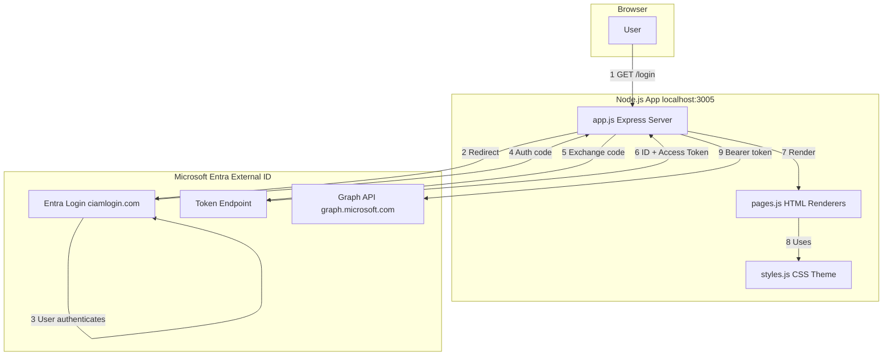
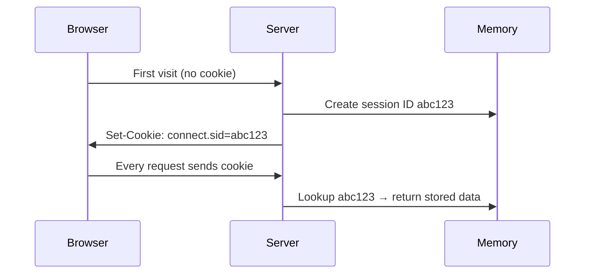
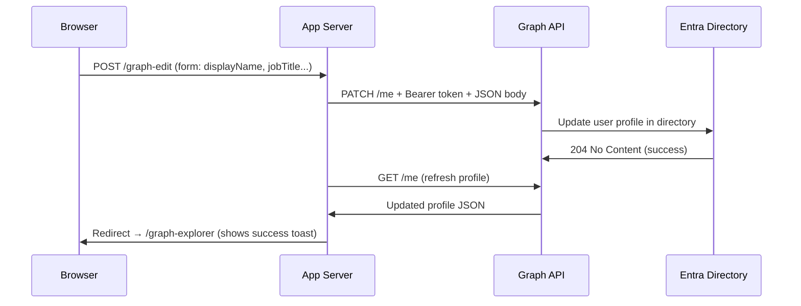
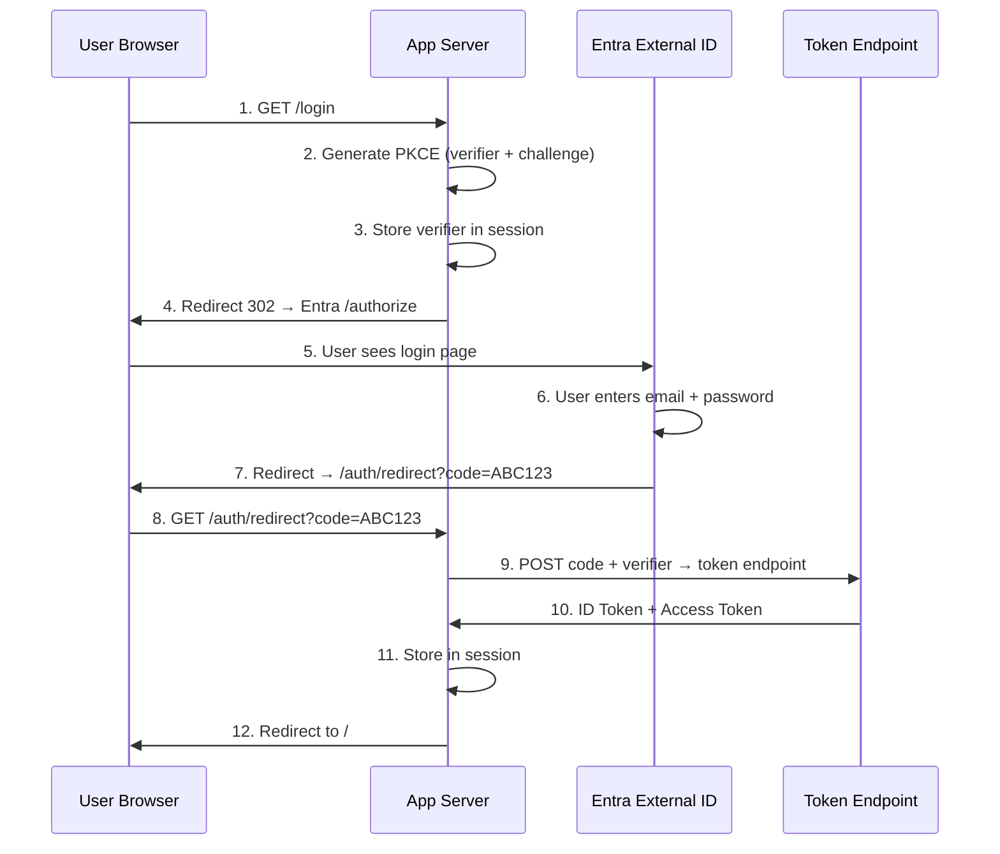
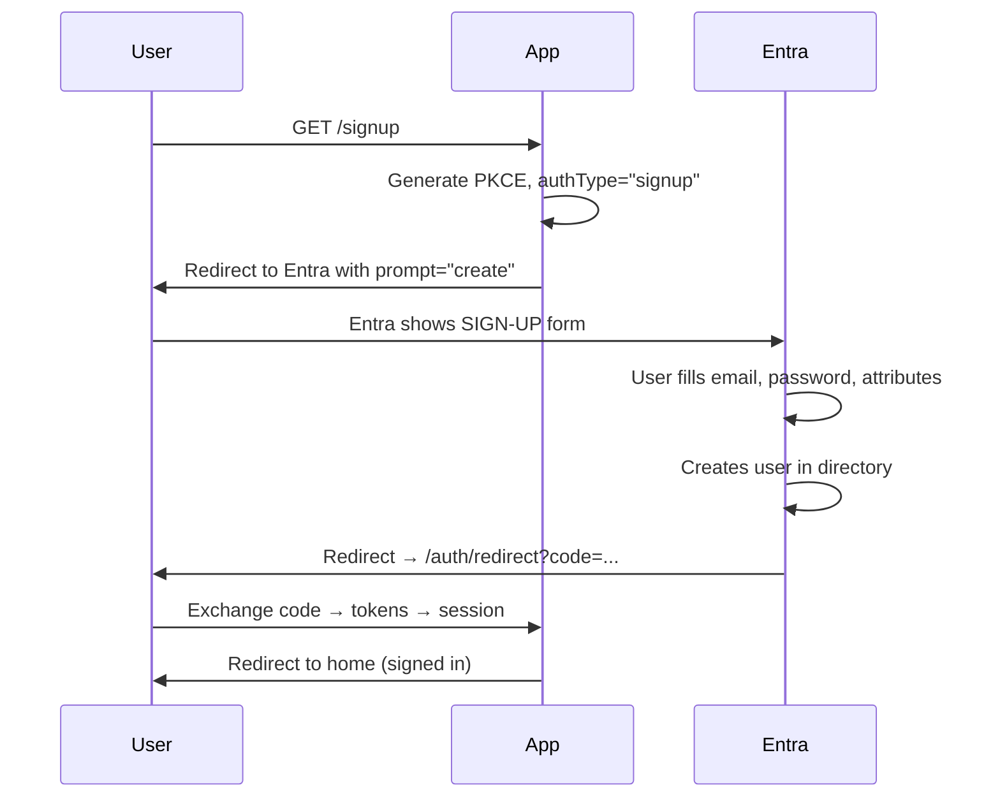
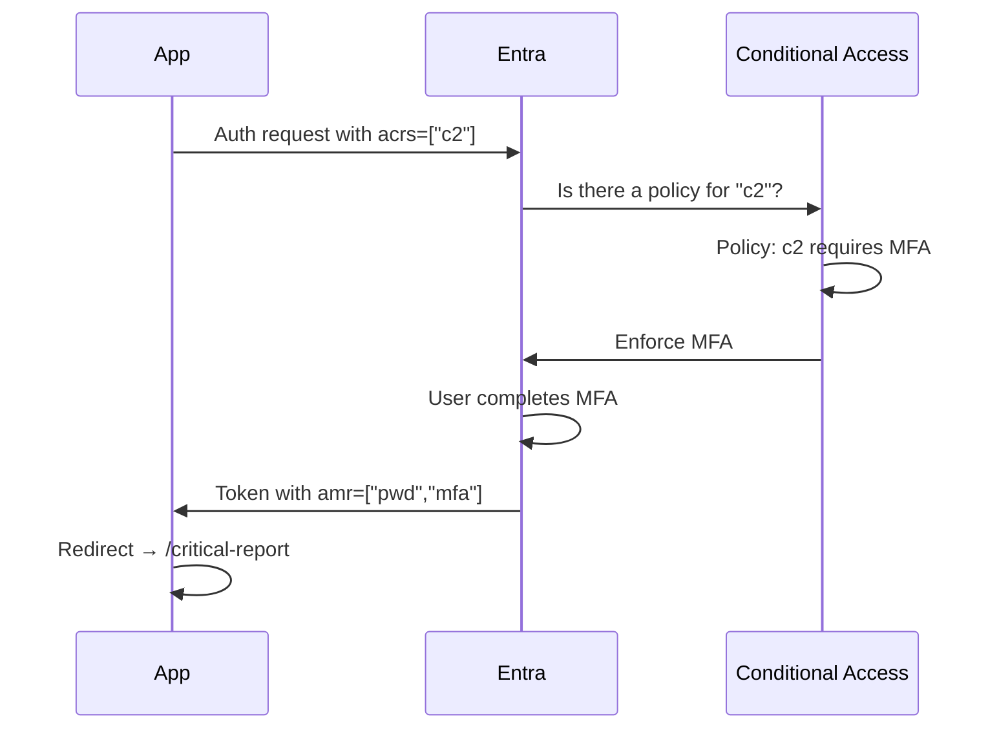
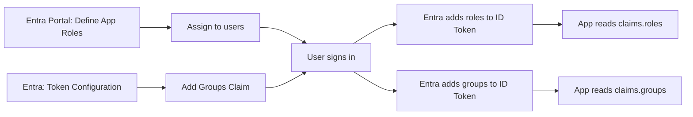
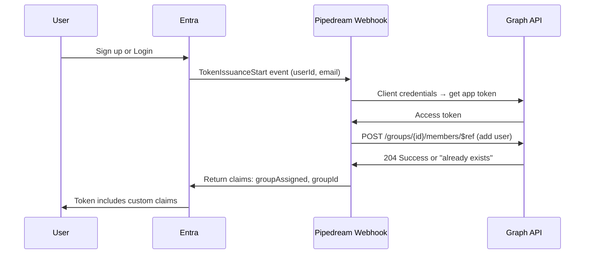
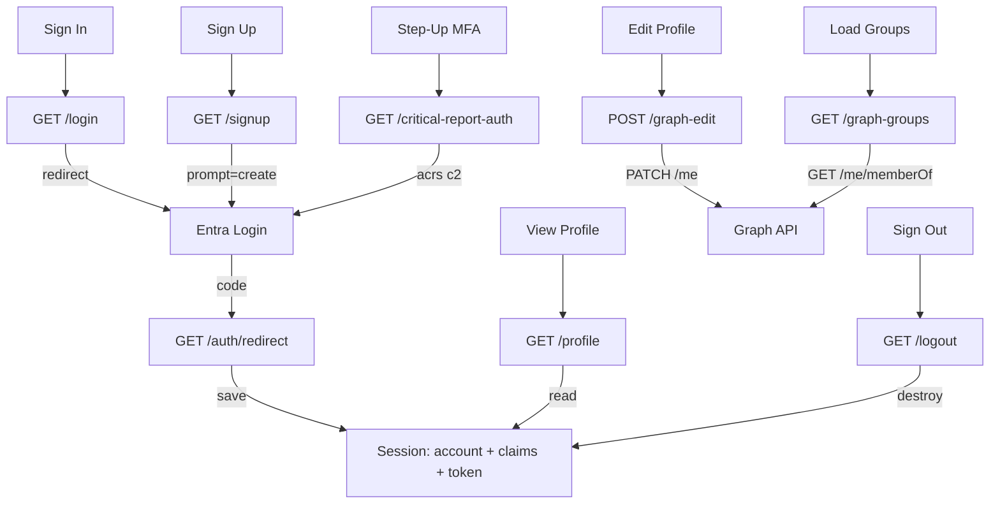

# MS Identity Hub – Complete Line-by-Line Code Explanation

> **App:** `ms-identity-app` | **Port:** 3005 | **Framework:** Express.js + MSAL Node

---

## Architecture



---

## app.js — Every Line Explained (403 lines)

---

### Lines 1–5 · Library Imports

```javascript
require("dotenv").config();                    // Line 1: Load .env file into process.env
const express = require("express");            // Line 2: Import Express web framework
const session = require("express-session");    // Line 3: Import session middleware
const msal = require("@azure/msal-node");      // Line 4: Import Microsoft Auth Library
const pages = require("./pages");              // Line 5: Import HTML page renderers
```

- Line 1 must be the FIRST line so all other code can access env vars via `process.env.XXX`
- Line 4 imports MSAL which provides `ConfidentialClientApplication` and `CryptoProvider`
- Line 5 imports a local module that generates HTML for each page

---

### Lines 7–8 · Create Express App

```javascript
const app = express();                         // Line 7: Create the Express application
const PORT = process.env.PORT || 3001;         // Line 8: Port from .env, default 3001
```

- `express()` creates an HTTP server instance
- PORT reads `3005` from `.env`, falls back to `3001` if missing

---

### Lines 10–27 · Entra ID Configuration

```javascript
/* ================= CONFIG ================= */           // Line 10: Section header

const CLIENT_ID     = process.env.CLIENT_ID;               // Line 12: App registration ID
const CLIENT_SECRET = process.env.CLIENT_SECRET;           // Line 13: App secret credential
const TENANT_ID     = process.env.TENANT_ID;               // Line 14: Entra tenant ID
const TENANT_NAME   = process.env.TENANT_NAME;             // Line 15: Tenant subdomain
const USE_CIAM      = process.env.USE_CIAM === "true";     // Line 16: External ID flag
const REDIRECT_URI  = `http://localhost:${PORT}/auth/redirect`; // Line 17: Callback URL

const needsSetup = !CLIENT_ID || CLIENT_ID === "REPLACE_WITH_YOUR_CLIENT_ID"; // Line 19

const AUTHORITY = USE_CIAM                                 // Lines 21-23: Login endpoint
    ? `https://${TENANT_NAME}.ciamlogin.com/${TENANT_ID}`  // External ID (CIAM)
    : `https://login.microsoftonline.com/${TENANT_ID}`;    // Standard Entra

console.log("Authority URL:", AUTHORITY);                  // Line 25: Debug log
console.log("Needs setup:", needsSetup);                   // Line 26: Debug log
```

**What each variable does:**

| Variable | Current Value | Purpose |
|----------|--------------|---------|
| `CLIENT_ID` | `0f2d162d-7b27-...` | Unique app identifier in Entra portal |
| `CLIENT_SECRET` | `pcA8Q~045o~...` | Secret proving the app's identity (like a password) |
| `TENANT_ID` | `b279e0a9-46fc-...` | Which Entra directory to authenticate against |
| `TENANT_NAME` | `entraexternaltestorg` | Subdomain used in the CIAM login URL |
| `USE_CIAM` | `true` | Uses `.ciamlogin.com` instead of `login.microsoftonline.com` |
| `REDIRECT_URI` | `http://localhost:3005/auth/redirect` | Where Entra sends the auth code after login |
| `AUTHORITY` | `https://entraexternaltestorg.ciamlogin.com/b279e0a9-...` | Full Entra login endpoint |
| `needsSetup` | `false` | `true` if CLIENT_ID is missing — shows setup instructions |

---

### Lines 28–43 · MSAL Client Setup

```javascript
/* ================= MSAL ================= */             // Line 28

let cca = null;                                            // Line 30: Will hold MSAL client
let cryptoProvider = null;                                 // Line 31: Will hold PKCE generator

if (!needsSetup) {                                         // Line 33: Only init if configured
    const msalConfig = {                                   // Line 34: MSAL configuration object
        auth: {                                            // Line 35
            clientId: CLIENT_ID,                           // Line 36: App ID
            authority: AUTHORITY,                          // Line 37: Login endpoint
            clientSecret: CLIENT_SECRET,                   // Line 38: App secret
        },                                                 // Line 39
    };                                                     // Line 40
    cca = new msal.ConfidentialClientApplication(msalConfig); // Line 41: Create MSAL client
    cryptoProvider = new msal.CryptoProvider();             // Line 42: Create PKCE generator
}                                                          // Line 43
```

- **`ConfidentialClientApplication`** — for server-side apps that can keep a secret safe. SPAs use `PublicClientApplication` instead
- **`CryptoProvider`** — generates PKCE codes: a random `verifier` string and its SHA-256 `challenge`
- PKCE prevents attackers from intercepting and replaying authorization codes

---

### Lines 45–54 · Middleware

```javascript
/* ================= MIDDLEWARE ================= */        // Line 45

app.use(session({                                          // Line 47: Enable sessions
    secret: "ms-identity-demo-secret-2025",                // Line 48: HMAC signing key
    resave: false,                                         // Line 49: Don't re-save unchanged
    saveUninitialized: false,                              // Line 50: Don't make empty sessions
}));                                                       // Line 51

app.use(express.urlencoded({ extended: true }));           // Line 53: Parse form POST data
app.use(express.json());                                   // Line 54: Parse JSON bodies
```

**How sessions work:**



**What gets stored in the session after login:**
```javascript
req.session.account      // { name, username, tenantId, localAccountId }
req.session.claims       // { sub, oid, name, email, iss, aud, iat, exp, roles, groups, amr }
req.session.accessToken  // "eyJ0eXAi..." JWT string for Graph API
req.session.graphProfile // { displayName, givenName, surname, jobTitle, ... }
req.session.graphGroups  // [{ id, displayName, description }, ...]
```

---

### Lines 56–60 · Scopes

```javascript
/* ================= SCOPES ================= */           // Line 56

const BASE_SCOPES  = ["openid", "profile", "email"];       // Line 58: Sign-in scopes
const GRAPH_SCOPES = ["User.ReadWrite", "GroupMember.Read.All"]; // Line 59: API scopes
const ALL_SCOPES   = [...BASE_SCOPES, ...GRAPH_SCOPES];    // Line 60: Combined
```

| Scope | Purpose |
|-------|---------|
| `openid` | Returns an ID token (required for OpenID Connect) |
| `profile` | Adds `name`, `preferred_username` to token |
| `email` | Adds `email` claim to token |
| `User.ReadWrite` | Read AND write the user's profile via Graph API |
| `GroupMember.Read.All` | Read group memberships via Graph API |

---

### Lines 62–125 · Page Routes (10 GET routes)

#### Line 65 · `GET /` — Landing Page

```javascript
app.get("/", (req, res) => {                               // Line 65
    res.send(pages.renderLanding(req.session.account, needsSetup)); // Line 66
});                                                        // Line 67
```

- Calls `renderLanding()` passing the user account (or null) and setup flag
- If not logged in → shows Sign In / Sign Up buttons and feature cards
- If logged in → shows greeting bar "Signed in as [name]"
- If `needsSetup` → shows Entra registration step-by-step guide

#### Lines 70–72 · `GET /profile` — User Profile

```javascript
app.get("/profile", (req, res) => {                        // Line 70
    res.send(pages.renderProfile(req.session.account, req.session.claims)); // Line 71
});                                                        // Line 72
```

- Shows: Display Name, Email, Tenant ID, Object ID, Issuer, Token Version, Auth Time, Expiry
- Shows ALL ID token claims as colored badges
- If not logged in → "Please sign in" message

#### Lines 74–76 · `GET /tokens` — Token Inspector

```javascript
app.get("/tokens", (req, res) => {                         // Line 74
    res.send(pages.renderTokens(req.session.account, req.session.claims, req.session.accessToken)); // Line 75
});                                                        // Line 76
```

- Decodes the JWT access token (splits by `.`, base64-decodes header + payload)
- Shows ID token claims (green badges) and access token claims (purple badges)
- Shows raw JWT header and the full access token string

#### Lines 78–87 · `GET /graph-explorer` — Graph Profile Editor

```javascript
app.get("/graph-explorer", (req, res) => {                 // Line 78
    res.send(pages.renderGraphExplorer(                    // Line 79
        req.session.account, req.session.graphResult,      // Line 80
        req.session.graphProfile, req.session.graphGroups,  // Line 81
        req.session.editSuccess, req.session.editError     // Line 82
    ));                                                    // Line 83
    delete req.session.editSuccess;                        // Line 85: Clear success flash
    delete req.session.editError;                          // Line 86: Clear error flash
});                                                        // Line 87
```

- Passes 6 pieces of session data to the renderer
- Lines 85-86: **Flash message pattern** — success/error messages are deleted after display so they only show once
- Shows: profile edit form, group memberships, raw API call buttons

#### Lines 90–92 · `GET /authorization` — Roles & Groups

```javascript
app.get("/authorization", (req, res) => {                  // Line 90
    res.send(pages.renderAuthorization(req.session.account, req.session.claims)); // Line 91
});                                                        // Line 92
```

- Reads `claims.roles` → displays app roles assigned to user
- Reads `claims.groups` → displays security group Object IDs
- Demonstrates role-gated content: Admin section only visible if `claims.roles.includes("Admin")`

#### Lines 95–98 · `GET /step-up-auth` — Step-Up Authentication

```javascript
app.get("/step-up-auth", (req, res) => {                   // Line 95
    res.send(pages.renderStepUpAuth(req.session.account, req.session.claims, req.session.stepUpResult)); // Line 96
    delete req.session.stepUpResult;                       // Line 97: Clear after display
});                                                        // Line 98
```

- Shows current auth level: 🟢 MFA / 🟡 Password only / 🔴 Not authenticated
- Checks `claims.amr` for `"mfa"`, `claims.acrs` for `"c2"`
- Has button to trigger MFA re-authentication → critical report

#### Lines 101–103 · `GET /critical-report` — MFA-Gated Report

```javascript
app.get("/critical-report", (req, res) => {                // Line 101
    res.send(pages.renderCriticalReport(req.session.account, req.session.claims)); // Line 102
});                                                        // Line 103
```

- Only accessible after completing MFA via `/critical-report-auth`
- Shows security status table, 5 security recommendations, identity summary
- Has "Sign Out & End Session" button

#### Lines 106–124 · Informational Pages (no auth required)

```javascript
app.get("/auth-flows", (req, res) => {                     // Line 106
    res.send(pages.renderAuthFlows(req.session.account));  // Line 107: OAuth flow diagrams
});
app.get("/permissions", (req, res) => {                    // Line 110
    res.send(pages.renderPermissions(req.session.account)); // Line 111: Scopes & permissions
});
app.get("/conditional-access", (req, res) => {             // Line 114
    res.send(pages.renderConditionalAccess(req.session.account)); // Line 115: CA policies
});
app.get("/app-registrations", (req, res) => {              // Line 118
    res.send(pages.renderAppRegistrations(req.session.account)); // Line 119: Registration guide
});
app.get("/security", (req, res) => {                       // Line 122
    res.send(pages.renderSecurity(req.session.account));   // Line 123: Security practices
});
```

- These 5 pages are purely educational — no authentication needed
- They only receive `account` to show/hide sidebar Sign In vs Sign Out

---

### Lines 127–150 · `GET /graph-call` — Raw Graph API Call

```javascript
app.get("/graph-call", async (req, res) => {               // Line 127
    if (!req.session.account || !req.session.accessToken) { // Line 128: AUTH GUARD
        req.session.graphResult = { _error: "Not signed in or no access token available" }; // Line 129
        return res.redirect("/graph-explorer");            // Line 130
    }

    const endpoint = req.query.endpoint || "me";           // Line 133: Default endpoint
    const graphUrl = `https://graph.microsoft.com/v1.0/${endpoint}`; // Line 134

    try {                                                  // Line 136
        const response = await fetch(graphUrl, {           // Line 137: HTTP GET to Graph
            headers: { Authorization: `Bearer ${req.session.accessToken}` }, // Line 138: Bearer token
        });
        if (response.ok) {                                 // Line 140: Status 200
            req.session.graphResult = await response.json(); // Line 141: Store JSON result
        } else {                                           // Line 142
            const errText = await response.text();         // Line 143
            req.session.graphResult = { _error: `Graph API returned ${response.status}`, details: errText }; // Line 144
        }
    } catch (err) {                                        // Line 146
        req.session.graphResult = { _error: err.message }; // Line 147
    }
    res.redirect("/graph-explorer");                       // Line 149: Show result on page
});                                                        // Line 150
```

- Line 128: Guards against unauthenticated access
- Line 133: Reads `?endpoint=me` or `?endpoint=organization` from query string
- Line 138: Sends the access token as `Authorization: Bearer <token>` header
- Line 149: Redirects back to show the result — POST/Redirect/GET pattern

---

### Lines 153–170 · `GET /graph-refresh` — Refresh Profile Data

```javascript
app.get("/graph-refresh", async (req, res) => {            // Line 153
    if (!req.session.account || !req.session.accessToken) { // Line 154
        return res.redirect("/graph-explorer");            // Line 155
    }
    try {                                                  // Line 157
        const response = await fetch("https://graph.microsoft.com/v1.0/me", { // Line 158
            headers: { Authorization: `Bearer ${req.session.accessToken}` }, // Line 159
        });
        if (response.ok) {                                 // Line 161
            req.session.graphProfile = await response.json(); // Line 162: Update profile
        } else {                                           // Line 163
            req.session.editError = `Failed to load profile: ${response.status}`; // Line 164
        }
    } catch (err) {                                        // Line 166
        req.session.editError = `Error loading profile: ${err.message}`; // Line 167
    }
    res.redirect("/graph-explorer");                       // Line 169
});                                                        // Line 170
```

- Calls `GET /me` on Graph API and stores the response in `session.graphProfile`
- This refreshes the profile edit form with the latest data from Entra directory

---

### Lines 172–215 · `POST /graph-edit` — Edit Profile in Entra

```javascript
app.post("/graph-edit", async (req, res) => {              // Line 173
    if (!req.session.account || !req.session.accessToken) { // Line 174
        req.session.editError = "Not signed in or no access token"; // Line 175
        return res.redirect("/graph-explorer");            // Line 176
    }

    // Line 179: Extract all 6 form fields from POST body
    const { displayName, givenName, surname, jobTitle, mobilePhone, officeLocation } = req.body;

    // Lines 180-186: Build update object — only include non-empty fields
    const updateData = {};
    if (displayName !== undefined && displayName !== "") updateData.displayName = displayName;
    if (givenName !== undefined) updateData.givenName = givenName || null;    // null = clear
    if (surname !== undefined) updateData.surname = surname || null;
    if (jobTitle !== undefined) updateData.jobTitle = jobTitle || null;
    if (mobilePhone !== undefined) updateData.mobilePhone = mobilePhone || null;
    if (officeLocation !== undefined) updateData.officeLocation = officeLocation || null;

    try {                                                  // Line 188
        // Lines 189-196: PATCH request to Graph API
        const response = await fetch("https://graph.microsoft.com/v1.0/me", {
            method: "PATCH",                               // Line 190: Partial update
            headers: {
                Authorization: `Bearer ${req.session.accessToken}`, // Line 192
                "Content-Type": "application/json",        // Line 193
            },
            body: JSON.stringify(updateData),              // Line 195: Fields to update
        });

        if (response.ok || response.status === 204) {      // Line 198: 204 = success
            req.session.editSuccess = "Profile updated successfully in Entra ID!"; // Line 199
            // Lines 201-206: Auto-refresh profile after edit
            try {
                const refreshRes = await fetch("https://graph.microsoft.com/v1.0/me", {
                    headers: { Authorization: `Bearer ${req.session.accessToken}` },
                });
                if (refreshRes.ok) req.session.graphProfile = await refreshRes.json();
            } catch { }
        } else {                                           // Line 207
            const errText = await response.text();         // Line 208
            req.session.editError = `Graph API error (${response.status}): ${errText}`; // Line 209
        }
    } catch (err) {                                        // Line 211
        req.session.editError = `Error updating profile: ${err.message}`; // Line 212
    }
    res.redirect("/graph-explorer");                       // Line 214
});                                                        // Line 215
```

**This route ACTUALLY MODIFIES the user's profile in Entra ID!**



---

### Lines 217–242 · `GET /graph-groups` — Load Group Memberships

```javascript
app.get("/graph-groups", async (req, res) => {             // Line 218
    if (!req.session.account || !req.session.accessToken) { // Line 219
        return res.redirect("/graph-explorer");            // Line 220
    }

    try {                                                  // Line 223
        const response = await fetch("https://graph.microsoft.com/v1.0/me/memberOf", { // Line 224
            headers: { Authorization: `Bearer ${req.session.accessToken}` }, // Line 225
        });
        if (response.ok) {                                 // Line 227
            const data = await response.json();            // Line 228
            // Line 229: Filter to ONLY groups (memberOf returns roles, admin units too)
            req.session.graphGroups = (data.value || [])
                .filter(v => v["@odata.type"] === "#microsoft.graph.group")
                .map(g => ({
                    id: g.id,
                    displayName: g.displayName,
                    description: g.description,
                }));
        } else {                                           // Line 234
            const errText = await response.text();         // Line 235
            req.session.editError = `Failed to load groups (${response.status}): ${errText}`; // Line 236
        }
    } catch (err) {                                        // Line 238
        req.session.editError = `Error loading groups: ${err.message}`; // Line 239
    }
    res.redirect("/graph-explorer");                       // Line 241
});                                                        // Line 242
```

- Line 224: `GET /me/memberOf` returns ALL directory objects the user belongs to
- Line 229: Filters for `#microsoft.graph.group` type only (excludes roles, admin units)
- Requires `GroupMember.Read.All` scope with admin consent

---

### Lines 244–268 · `GET /login` — USER SIGN-IN

```javascript
app.get("/login", async (req, res) => {                    // Line 245
    if (needsSetup) {                                      // Line 246: Check configuration
        return res.send(pages.renderError("App Not Configured", {
            message: "Please update .env with your CLIENT_ID, CLIENT_SECRET, and TENANT_ID."
        }));
    }

    try {                                                  // Line 252
        // Lines 253-254: Generate PKCE codes (Proof Key for Code Exchange)
        const { verifier, challenge } = await cryptoProvider.generatePkceCodes();
        req.session.pkceCodes = { verifier, challenge };   // Store verifier in session
        req.session.authType = "login";                    // Line 255: Mark as login flow

        // Lines 257-262: Build the Entra authorization URL
        const authCodeUrl = await cca.getAuthCodeUrl({
            scopes: ALL_SCOPES,                            // Line 258: What permissions to request
            redirectUri: REDIRECT_URI,                     // Line 259: Callback URL
            codeChallenge: challenge,                      // Line 260: PKCE challenge (SHA-256)
            codeChallengeMethod: "S256",                   // Line 261: Hash method
        });
        res.redirect(authCodeUrl);                         // Line 263: Send to Entra login page
    } catch (err) {                                        // Line 264
        console.error("Login error:", err);                // Line 265
        res.send(pages.renderError("Login Failed", err));  // Line 266
    }
});                                                        // Line 268
```

**Complete Login Flow:**



**What is PKCE?**
- App generates random `verifier` and its SHA-256 hash `challenge`
- `challenge` is sent to Entra with the auth request
- `verifier` stays secret on the server
- When exchanging the code, `verifier` proves it's the same app
- Prevents attackers from intercepting and replaying auth codes

---

### Lines 270–294 · `GET /signup` — USER CREATION (New Account)

```javascript
app.get("/signup", async (req, res) => {                   // Line 270
    if (needsSetup) {                                      // Line 271
        return res.send(pages.renderError("App Not Configured", {
            message: "Please update .env..."
        }));
    }

    try {                                                  // Line 277
        const { verifier, challenge } = await cryptoProvider.generatePkceCodes(); // Line 278
        req.session.pkceCodes = { verifier, challenge };   // Line 279
        req.session.authType = "signup";                   // Line 280: Track as SIGNUP

        const authCodeUrl = await cca.getAuthCodeUrl({     // Line 282
            scopes: ALL_SCOPES,                            // Line 283
            redirectUri: REDIRECT_URI,                     // Line 284
            codeChallenge: challenge,                      // Line 285
            codeChallengeMethod: "S256",                   // Line 286
            prompt: "create",                              // Line 287: ← SHOWS SIGN-UP FORM
        });
        res.redirect(authCodeUrl);                         // Line 289
    } catch (err) {                                        // Line 290
        console.error("Signup error:", err);               // Line 291
        res.send(pages.renderError("Sign Up Failed", err)); // Line 292
    }
});                                                        // Line 294
```

- **`prompt: "create"`** (line 287) is the KEY DIFFERENCE from login — tells Entra to show the self-service sign-up form instead of the login form
- The user creates a new account in the Entra directory
- After sign-up, the flow continues to `/auth/redirect` just like login



---

### Lines 296–326 · `GET /critical-report-auth` — STEP-UP MFA

```javascript
app.get("/critical-report-auth", async (req, res) => {     // Line 297
    if (needsSetup || !req.session.account) {              // Line 298: Must be logged in
        return res.redirect("/step-up-auth");              // Line 299
    }

    try {                                                  // Line 302
        const { verifier, challenge } = await cryptoProvider.generatePkceCodes(); // Line 303
        req.session.pkceCodes = { verifier, challenge };   // Line 304
        req.session.authType = "critical-report";          // Line 305: Track flow type

        const authCodeUrl = await cca.getAuthCodeUrl({     // Line 307
            scopes: ALL_SCOPES,                            // Line 308
            redirectUri: REDIRECT_URI,                     // Line 309
            codeChallenge: challenge,                      // Line 310
            codeChallengeMethod: "S256",                   // Line 311
            prompt: "login",                               // Line 312: FORCE re-auth (no SSO)
            loginHint: req.session.account.username,       // Line 313: Pre-fill email
            claims: JSON.stringify({                        // Line 314: REQUEST MFA
                id_token: {                                // Line 315
                    acrs: { essential: true, values: ["c2"] } // Line 316: Auth context c2
                }                                          // Line 317
            }),                                            // Line 318
        });
        res.redirect(authCodeUrl);                         // Line 320
    } catch (err) {                                        // Line 321
        console.error("Critical report auth error:", err); // Line 322
        req.session.stepUpResult = { success: false, message: `MFA verification failed: ${err.message}` }; // Line 323
        res.redirect("/step-up-auth");                     // Line 324
    }
});                                                        // Line 326
```

**Step-up parameters:**

| Parameter | Line | Value | Effect |
|-----------|------|-------|--------|
| `prompt` | 312 | `"login"` | Forces re-auth even with SSO |
| `loginHint` | 313 | User's email | Pre-fills email field |
| `claims.id_token.acrs` | 316 | `["c2"]` | Requests auth context "c2" = MFA |



---

### Lines 328–381 · `GET /auth/redirect` — TOKEN EXCHANGE (Most Critical Route)

```javascript
app.get("/auth/redirect", async (req, res) => {            // Line 328
    // Lines 329-333: Handle errors from Entra
    if (req.query.error) {                                 // Line 329
        return res.send(pages.renderError(req.query.error, {
            message: req.query.error_description || "Unknown error from Entra"
        }));
    }

    try {                                                  // Line 335
        // Lines 336-341: Exchange auth code for tokens
        const response = await cca.acquireTokenByCode({    // Line 336
            code: req.query.code,                          // Line 337: Auth code from URL
            scopes: ALL_SCOPES,                            // Line 338: Same scopes
            redirectUri: REDIRECT_URI,                     // Line 339: Must match exactly
            codeVerifier: req.session.pkceCodes?.verifier, // Line 340: PKCE proof
        });

        const authType = req.session.authType || "login";  // Line 343: What flow started this
        req.session.account = response.account;            // Line 344: Store user account
        req.session.claims = response.idTokenClaims;       // Line 345: Store ID token claims
        console.log("Login successful:", response.account.username); // Line 346

        if (response.accessToken) {                        // Line 348: If access token received
            req.session.accessToken = response.accessToken; // Line 349: Store it
            console.log("Access token received");          // Line 350

            // Lines 352-358: Auto-load profile for Graph editor
            try {
                const profileRes = await fetch("https://graph.microsoft.com/v1.0/me", {
                    headers: { Authorization: `Bearer ${response.accessToken}` },
                });
                if (profileRes.ok) req.session.graphProfile = await profileRes.json();
            } catch { }
        }

        // Lines 362-364: Route based on auth type
        if (authType === "critical-report") {              // Line 362
            return res.redirect("/critical-report");       // Line 363: MFA → report page
        }

        if (authType === "step-up") {                      // Line 367
            req.session.stepUpResult = {                   // Line 368
                success: true,                             // Line 369
                message: "Step-up authentication completed successfully!", // Line 370
                claims: response.idTokenClaims,            // Line 371: Updated claims
            };
            return res.redirect("/step-up-auth");          // Line 373
        }

        res.redirect("/");                                 // Line 376: Normal login → home
    } catch (err) {                                        // Line 377
        console.error("Token acquisition error:", err);    // Line 378
        res.send(pages.renderError("Token Acquisition Failed", err)); // Line 379
    }
});                                                        // Line 381
```

**What MSAL returns (`response`):**
```javascript
{
    account: {
        name: "Ujjwal Sinha",
        username: "ujjwal@entraexternaltestorg.onmicrosoft.com",
        tenantId: "b279e0a9-...",
        localAccountId: "abc123-..."
    },
    idTokenClaims: {
        sub: "...", oid: "...", name: "Ujjwal Sinha", email: "...",
        iss: "https://...", aud: "0f2d162d-...",
        iat: 1709600000, exp: 1709603600,
        roles: ["Admin"], groups: ["7f362.."],
        amr: ["pwd"], ver: "2.0"
    },
    accessToken: "eyJ0eXAiOiJKV1Qi..."
}
```

---

### Lines 383–387 · `GET /logout` — SIGN-OUT

```javascript
app.get("/logout", (req, res) => {                         // Line 383
    req.session.destroy(() => {                             // Line 384: Delete ALL session data
        res.redirect(`http://localhost:${PORT}`);           // Line 385: Redirect to home
    });                                                    // Line 386
});                                                        // Line 387
```

- `req.session.destroy()` wipes: account, claims, accessToken, graphProfile, graphGroups
- The `connect.sid` cookie becomes invalid
- This is **local logout only** — the Entra SSO cookie remains active

---

### Lines 389–402 · Server Startup

```javascript
app.listen(PORT, () => {                                   // Line 391: Start HTTP server
    console.log("╔══════════════════════════════════════════════════════╗");
    console.log("║  ◆  MS Identity Platform Demo (Premium)             ║");
    console.log(`║  🌐 http://localhost:${PORT}                            ║`);
    console.log("║  🔐 Authority: " + (USE_CIAM ? "CIAM" : "Standard") + " ║");
    console.log("╚══════════════════════════════════════════════════════╝");
});
```

---

## pages.js — Every Function Explained (694 lines)

---

### Lines 1–7 · `escapeHtml(str)` — XSS Prevention

```javascript
const CSS = require("./styles");                           // Line 2: Import CSS string

function escapeHtml(str) {                                 // Line 4
    if (!str) return "";                                   // Line 5: Handle null/undefined
    return String(str)
        .replace(/&/g, "&amp;")                            // & → &amp;
        .replace(/</g, "&lt;")                             // < → &lt;
        .replace(/>/g, "&gt;")                             // > → &gt;
        .replace(/"/g, "&quot;");                          // " → &quot;
}
```

- Used on ALL user data before rendering to prevent XSS attacks
- `<script>alert('hack')</script>` becomes `&lt;script&gt;alert('hack')&lt;/script&gt;`

---

### Lines 9–62 · `sidebarNav(account, activePage)` — Sidebar Navigation

```javascript
function sidebarNav(account, activePage) {
    const links = [
        { section: "Overview", items: [
            { icon: "🏠", label: "Home", path: "/", id: "home" },
        ]},
        { section: "Identity", items: [
            { icon: "👤", label: "User Profile", path: "/profile", auth: true },
            { icon: "🔍", label: "Token Inspector", path: "/tokens", auth: true },
            { icon: "📡", label: "Graph Profile Editor", path: "/graph-explorer", auth: true },
        ]},
        { section: "Authorization", items: [
            { icon: "🛡️", label: "Roles & Groups", path: "/authorization", isNew: true },
            { icon: "🔐", label: "Step-Up Auth", path: "/step-up-auth", isNew: true },
        ]},
        { section: "Learn", items: [
            { icon: "🔄", label: "Auth Flows", path: "/auth-flows" },
            { icon: "🔑", label: "Permissions", path: "/permissions" },
            { icon: "⚡", label: "Conditional Access", path: "/conditional-access" },
            { icon: "📋", label: "App Registrations", path: "/app-registrations" },
            { icon: "🏰", label: "Security", path: "/security" },
        ]},
    ];

    // Lines 44-52: Loop through sections → render each link
    for (const sec of links) {
        // Add section label (e.g. "OVERVIEW", "IDENTITY")
        for (const l of sec.items) {
            // Add CSS class "active" if activePage matches l.id
            // Add "Auth" badge if l.auth is true
            // Add "New" badge if l.isNew is true
        }
    }

    // Lines 54-56: If account exists (signed in):
    //   → Show avatar with first 2 letters of name
    //   → Show user name and email
    //   → Show "Sign Out" button → /logout

    // Lines 57-59: If no account (not signed in):
    //   → Show "🔑 Sign In" button → /login
    //   → Show "✨ Sign Up" button → /signup
}
```

---

### Lines 64–70 · `layout(title, content, account, activePage)` — Page Wrapper

```javascript
function layout(title, content, account, activePage) {
    const nav = sidebarNav(account, activePage);           // Build sidebar HTML
    return `<!DOCTYPE html><html lang="en"><head>
        <meta charset="UTF-8">
        <meta name="viewport" content="width=device-width, initial-scale=1.0">
        <title>${escapeHtml(title)} — MS Identity Hub</title>
        ${CSS}                                             // Inject full CSS from styles.js
    </head><body>
        ${nav}                                             // Sidebar navigation
        <div class="app-wrapper">
            <div class="main-content">${content}</div>     // Page content
        </div>
    </body></html>`;
}
```

- Every render function calls this — wraps content with HTML + sidebar + CSS

---

### Lines 77–136 · `renderLanding(account, needsSetup)` — Home Page

```javascript
function renderLanding(account, needsSetup) {
    // Lines 78-91: Setup banner — shown when needsSetup is true
    //   7-step guide: Create app registration, set redirect URI,
    //   create client secret, copy IDs, update .env, restart server

    // Lines 93-95: Greeting bar — shown when signed in
    //   "Signed in as Ujjwal Sinha" with green pulsing dot

    // Lines 97-108: 10 feature cards array
    const cards = [
        { icon: "👤", title: "User Profile", desc: "View your identity claims...",
          path: "/profile", tag: "auth", accent: "linear-gradient(135deg,#ff6b6b,#fbbf24)" },
        { icon: "🔍", title: "Token Inspector", desc: "Decode and inspect...",
          path: "/tokens", tag: "auth", accent: "linear-gradient(135deg,#a78bfa,#fb7185)" },
        { icon: "📡", title: "Graph Profile Editor", desc: "Edit your profile...",
          path: "/graph-explorer", tag: "auth", accent: "linear-gradient(135deg,#34d399,#2dd4bf)" },
        // ... 7 more cards for Authorization, Step-Up, Auth Flows, Permissions, etc.
    ];

    // Lines 110-116: Build card HTML with icon, title, description, tag badge
    //   tag "auth" → "🔒 Requires Sign-In" (red badge)
    //   tag "info" → "📖 Informational" (blue badge)

    // Lines 118-125: CTA section — shown when NOT signed in
    //   "Sign In" button → /login
    //   "Sign Up" button → /signup

    return layout("Home", `...all the HTML...`, account, "home");
}
```

---

### Lines 139–160 · `renderProfile(account, claims)` — User Profile

```javascript
function renderProfile(account, claims) {
    // Line 140: If not logged in → show "Please sign in" message
    if (!account) return layout("User Profile", "Please sign in...", null, "profile");

    // Lines 141-147: Build profile fields grid
    const fields = [
        ["Display Name", account.name],                    // From account object
        ["Email / Username", account.username],            // UPN or email
        ["Tenant ID", account.tenantId || claims?.tid],    // From account or claims
        ["Object ID (OID)", claims?.oid || account.localAccountId],
        ["Issuer", claims?.iss],                           // Token issuer URL
        ["Token Version", claims?.ver],                    // "2.0"
        ["Auth Time", claims?.iat ? new Date(claims.iat * 1000).toLocaleString() : null],
        ["Expiry", claims?.exp ? new Date(claims.exp * 1000).toLocaleString() : null],
    ];
    // Each field rendered as: label (uppercase grey) + value (white)

    // Lines 149-155: ALL claims rendered as badges
    for (const [k, v] of Object.entries(claims)) {
        // <span class="claim-badge"><span class="key">oid:</span> abc123-def456</span>
    }
}
```

---

### Lines 163–188 · `renderTokens(account, claims, accessToken)` — Token Inspector

```javascript
function renderTokens(account, claims, accessToken) {
    // Lines 165-168: JWT decoder (nested function)
    function decodeJwt(token) {
        if (!token) return null;
        const parts = token.split(".");                    // Split header.payload.signature
        return {
            header: JSON.parse(Buffer.from(parts[0], "base64url").toString()),
            payload: JSON.parse(Buffer.from(parts[1], "base64url").toString()),
            signature: parts[2]
        };
    }

    const decoded = decodeJwt(accessToken);                // Line 169: Decode access token

    // Line 170: ID token claims → green badges (from claims object)
    // Line 171: Access token claims → purple badges (from decoded.payload)
    // Lines 179-185: Raw JWT header JSON + full access token string
    // If no access token → "⚠️ No access token — configure API_SCOPE in .env"
}
```

---

### Lines 191–208 · `renderAuthFlows(account)` — Auth Flows Page

```javascript
function renderAuthFlows(account) {
    const flows = [
        { name: "Authorization Code + PKCE", icon: "🔑", recommended: true,
          desc: "The most secure flow for web and mobile apps.",
          steps: ["User clicks Login", "Redirect to /authorize", "User authenticates",
                  "Auth code returned", "App exchanges code + PKCE", "Tokens received"] },
        { name: "Client Credentials", icon: "🤖",
          desc: "For server-to-server (daemon) apps.",
          steps: ["App sends client_id + secret", "Token endpoint validates",
                  "Access token returned", "App calls API"] },
        { name: "On-Behalf-Of (OBO)", icon: "🔗",
          desc: "Middle-tier API uses user's token to call downstream APIs." },
        { name: "Device Code", icon: "📱",
          desc: "For devices with limited input (IoT, CLI tools)." },
    ];
    // Each flow: card with icon, name, description, step-by-step flow diagram
}
```

---

### Lines 313–389 · `renderGraphExplorer(...)` — Graph Profile Editor

```javascript
function renderGraphExplorer(account, graphResult, graphProfile, graphGroups, editSuccess, editError) {
    // Line 314: If not logged in → "Please sign in"

    // Line 316: Toast feedback (one-time flash messages)
    const feedback = editSuccess ? `<div class="toast toast-success">✅ ${escapeHtml(editSuccess)}</div>`
                   : editError ? `<div class="toast toast-error">❌ ${escapeHtml(editError)}</div>` : "";

    // Lines 318-336: Profile edit form
    //   6 input fields pre-populated from graphProfile:
    //   displayName, jobTitle, givenName, surname, mobilePhone, officeLocation
    //   "💾 Save Changes to Entra" button → POST /graph-edit
    //   "🔄 Refresh Profile" button → GET /graph-refresh

    // Lines 338-349: Group memberships section
    //   If no groups loaded → "Load group memberships →" link → GET /graph-groups
    //   If loaded → list: 👥 icon + displayName + id for each group

    // Lines 351-355: Raw API response section
    //   Green border for success, red for error
    //   JSON displayed in monospace code block

    // Lines 368-374: Quick API call buttons
    //   "📧 GET /me" → /graph-call?endpoint=me
    //   "🏢 GET /organization" → /graph-call?endpoint=organization

    // Lines 376-387: "How It Works" diagram
    //   🔑 Access Token → Authorization: Bearer → graph.microsoft.com → 📊 JSON Response
}
```

---

### Lines 412–467 · `renderAuthorization(account, claims)` — Roles & Groups

```javascript
function renderAuthorization(account, claims) {
    // Line 413: Read app roles from ID token
    const rolesHtml = claims?.roles
        ? claims.roles.map(r => `<span class="role-badge">🛡️ ${escapeHtml(r)}</span>`).join("")
        : "No app roles assigned. Configure in Entra Portal → App roles.";

    // Line 414: Read group claims from ID token
    const groupsHtml = claims?.groups
        ? claims.groups.map(g => `<span class="group-badge">👥 ${escapeHtml(g)}</span>`).join("")
        : "No group claims. Enable in Entra → Token configuration → Add groups claim.";

    // Lines 441-453: ID Token vs Access Token comparison table
    // Lines 454-464: How to configure (app roles + group claims steps)

    // Lines 427-435: Role-gated content demo
    if (claims?.roles?.includes('Admin')) {
        // Show: "✅ You have Admin role — full access!"
        // Show: 🟣 Admin Section — Access Granted (full opacity)
    } else {
        // Show: "⚠️ You don't have Admin role — restricted view."
        // Show: 🔒 Admin Section — Requires Admin Role (dimmed, 50% opacity)
    }
}
```



---

### Lines 470–529 · `renderStepUpAuth(account, claims, stepUpResult)` — Step-Up Auth

```javascript
function renderStepUpAuth(account, claims, stepUpResult) {
    // Lines 471-474: Detect authentication level
    const amr = claims?.amr || [];                         // Auth Methods References
    const hasMfa = amr.includes("mfa")                     // Was MFA used?
        || claims?.acr === "possessionorinherence"          // Strong auth?
        || claims?.acrs?.includes("c2");                    // Auth context c2?

    const authLevel = hasMfa ? "high" : account ? "medium" : "low";
    const authLevelLabel = hasMfa
        ? "🟢 Multi-Factor Authenticated"
        : account ? "🟡 Single-Factor (Password only)"
        : "🔴 Not Authenticated";

    // Lines 479-487: Auth status card with colored dot indicator
    //   Shows amr values as code badges
    //   Shows acr, auth_time claims

    // Line 489: "📋 View Critical Report" button → GET /critical-report-auth
    //   Triggers MFA re-auth flow

    // Lines 498-503: Step-up result (after MFA completes)
    //   Shows success/failure message + updated claims JSON
}
```

| `amr` value | Meaning |
|-------------|---------|
| `pwd` | Password was used |
| `mfa` | Multi-factor authentication completed |
| `otp` | One-time passcode |
| `fido` | FIDO2 security key |

---

### Lines 532–621 · `renderCriticalReport(account, claims)` — MFA-Gated Report

```javascript
function renderCriticalReport(account, claims) {
    // Line 533: Access denied if not signed in

    // Lines 540-542: MFA status detection
    const amr = claims?.amr || [];
    const hasMfa = amr.includes("mfa") || claims?.acr === "possessionorinherence";
    const authMethods = amr.length > 0 ? amr.join(", ") : "unknown";

    // Lines 552-559: "Identity Verified" card — green dot, auth methods, auth time

    // Lines 561-577: Security Overview table
    //   MFA: Active | PKCE: Active | Token Encryption: Active
    //   Session Management: Active
    //   App Roles: Configured/Not Configured
    //   Group Claims: Configured/Not Configured

    // Lines 579-601: 5 Critical Recommendations
    //   1. Rotate Client Secrets every 90 days
    //   2. Enforce Conditional Access Policies
    //   3. Monitor Sign-In Logs (Sentinel integration)
    //   4. Principle of Least Privilege
    //   5. Token Lifetime & Refresh policies

    // Lines 603-613: Identity Summary (name, email, tenant, OID, methods, MFA yes/no)
    // Lines 615-619: "🚪 Sign Out & End Session" button → /logout
}
```

---

### Lines 624–671 · Dashboard Functions

```javascript
renderRoleSelector(account)                    // Line 624: Role picker (Doctor/Consultant/Student/Medical Student)
dashboardLayout(account, config)               // Line 642: Shared dashboard with stats, actions, activities
renderDoctorDashboard(account, claims)         // Line 656: 🩺 Green theme, patient stats
renderConsultantDashboard(account, claims)     // Line 660: 💼 Blue theme, project stats
renderStudentDashboard(account, claims)        // Line 664: 🎓 Amber theme, course stats
renderMedicalStudentDashboard(account, claims) // Line 668: 🔬 Purple theme, rotation stats
```

---

### Lines 674–684 · `renderError(title, err)` — Error Page

```javascript
function renderError(title, err) {
    return layout("Error", `
        <div class="error-card">
            <h2>${escapeHtml(title)}</h2>
            <p>${escapeHtml(err?.message || String(err))}</p>
            <pre>${escapeHtml(err?.stack || "")}</pre>
            <a class="btn btn-primary" href="/">← Back to Home</a>
        </div>`, null);
}
```

---

### Lines 686–693 · Module Exports

```javascript
module.exports = {
    renderLanding, renderProfile, renderTokens, renderAuthFlows,
    renderPermissions, renderConditionalAccess, renderAppRegistrations,
    renderGraphExplorer, renderSecurity, renderError, escapeHtml,
    renderRoleSelector, renderDoctorDashboard, renderConsultantDashboard,
    renderStudentDashboard, renderMedicalStudentDashboard,
    renderAuthorization, renderStepUpAuth, renderCriticalReport,
};
```

- All 13 render functions + `escapeHtml` exported for use in `app.js`

---

## pipedream-group-assign.js — Custom Auth Extension (223 lines)



**Step-by-step:**
1. **Lines 34-41 · Parse request:** Extract `userId`, `userEmail`, `displayName` from Entra event body
2. **Lines 47-92 · Validate:** Check user ID exists and all env vars are set
3. **Lines 95-134 · Get Graph token:** Client credentials flow (`POST /oauth2/v2.0/token`)
4. **Lines 140-174 · Add to group:** `POST /groups/{id}/members/$ref` — adds user. If "already exists" → still success
5. **Lines 176-196 · Return claims:** Send `groupAssigned`, `assignedGroupId`, `groupAssignmentMessage` back to Entra

---

## Complete Flow Walkthroughs

### Sign-Up (New User Creation)
```
1. User clicks "✨ Sign Up" → GET /signup
2. Server: PKCE generated, authType="signup"
3. Server: Auth URL with prompt="create"
4. Browser → Entra sign-up form
5. User enters email, password, attributes
6. Entra creates user in directory
7. (Optional) Pipedream assigns user to group
8. Auth code → /auth/redirect
9. Exchange code → ID Token + Access Token
10. Store in session, auto-fetch /me
11. Redirect to home (signed in)
```

### Sign-In (Existing User)
```
1. User clicks "🔑 Sign In" → GET /login
2. PKCE, authType="login" (no prompt="create")
3-11. Same as sign-up
```

### Step-Up MFA → Critical Report
```
1. Click "📋 View Critical Report"
2. GET /critical-report-auth
3. PKCE, authType="critical-report"
4. Auth URL: prompt="login" + claims{acrs:["c2"]} + loginHint
5. Entra: forced re-auth + MFA
6. Exchange → amr=["pwd","mfa"]
7. authType==="critical-report" → /critical-report
```

### Sign-Out
```
1. Click "Sign Out" → GET /logout
2. req.session.destroy()
3. Redirect to home (signed out)
```

---

## Data Flow Summary



---

## Claims & Attributes Reference

### ID Token Claims

| Claim | Example | Description |
|-------|---------|-------------|
| `sub` | `abc123` | Subject — unique user ID for this app |
| `oid` | `abc123` | Object ID in Entra directory |
| `name` | `"Ujjwal Sinha"` | Display name |
| `email` | `"ujjwal@..."` | Email address |
| `iss` | `"https://...ciamlogin.com/..."` | Token issuer |
| `aud` | `"0f2d162d-..."` | Audience (your app's Client ID) |
| `iat` | `1709600000` | Issued at (Unix timestamp) |
| `exp` | `1709603600` | Expiry (~1 hour later) |
| `roles` | `["Admin"]` | App roles assigned |
| `groups` | `["7f362-..."]` | Security group IDs |
| `amr` | `["pwd","mfa"]` | Auth methods used |

### Graph API Attributes

| Attribute | Editable | Used In |
|-----------|----------|---------|
| `displayName` | ✅ | Profile edit form |
| `givenName` | ✅ | Profile edit form |
| `surname` | ✅ | Profile edit form |
| `jobTitle` | ✅ | Profile edit form |
| `mobilePhone` | ✅ | Profile edit form |
| `officeLocation` | ✅ | Profile edit form |
| `mail` | ❌ | Profile display |
| `id` | ❌ | Object ID |

---

## Security in the Code

| Concept | Where | How |
|---------|-------|-----|
| **PKCE** | `/login`, `/signup`, `/critical-report-auth` | verifier+challenge prevents code interception |
| **Server-side sessions** | `express-session` | Tokens never in browser JavaScript |
| **Bearer tokens** | `/graph-edit`, `/graph-groups` | Access token in Authorization header |
| **XSS prevention** | `escapeHtml()` | All user data HTML-escaped |
| **Step-up MFA** | `/critical-report-auth` | `claims` param + `acrs=["c2"]` |
